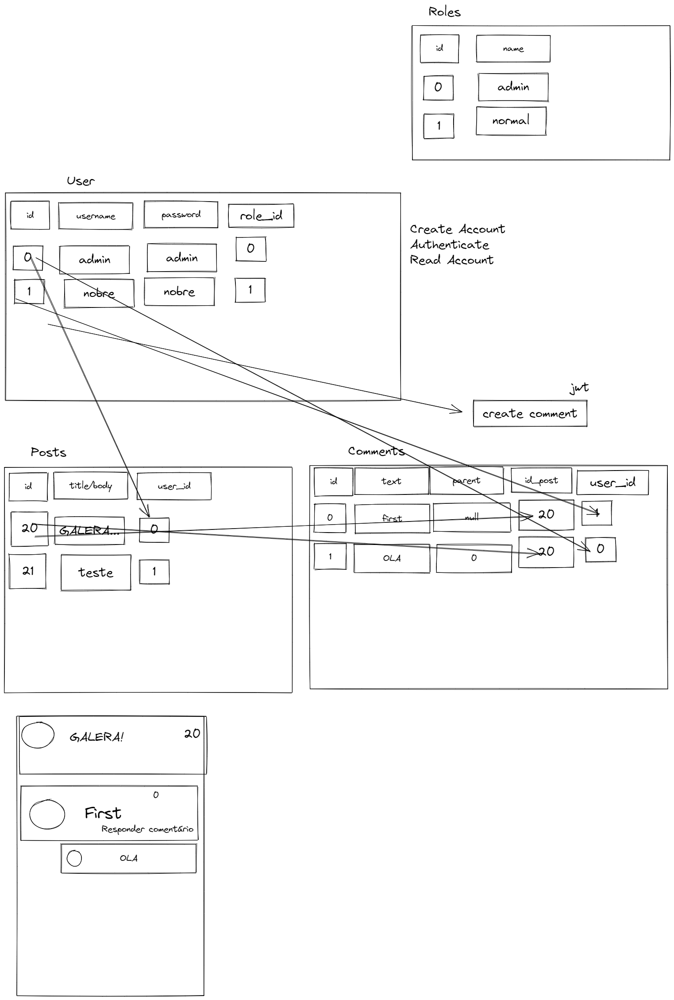

# Borum 

## Development

## MVP

- User Auth, Sign Up and Login
- Comment inside comments (like tabnews and reddit)
- Post feed
- User details page with delete and update options
- User roles, only the owner of the post can update it's own post.

## Post-MVP

- Community Guides
- Comments with likes

## Sources

- https://www.django-rest-framework.org/api-guide/authentication/
- https://medium.com/djangotube/django-roles-groups-and-permissions-introduction-a54d1070544